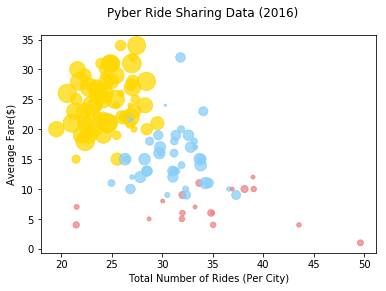
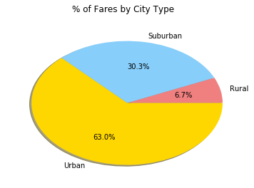
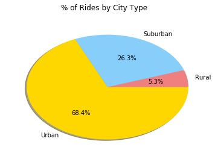
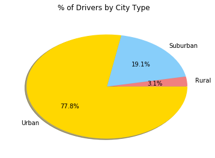

```python
import numpy as py
import csv as csv
import pandas as pd
import matplotlib.pyplot as plt
```


```python
cityFile = "city_data.csv"
rideFile = "ride_data.csv"
cityData = pd.read_csv(cityFile)
rideData = pd.read_csv(rideFile)
cityData.set_index("city", inplace = True)
print(cityData)
print(rideData)
```

                          driver_count      type
    city                                        
    Kelseyland                      63     Urban
    Nguyenbury                       8     Urban
    East Douglas                    12     Urban
    West Dawnfurt                   34     Urban
    Rodriguezburgh                  52     Urban
    South Josephville                4     Urban
    West Sydneyhaven                70     Urban
    Travisville                     37     Urban
    Torresshire                     70     Urban
    Lisaville                       66     Urban
    Mooreview                       34     Urban
    Smithhaven                      67     Urban
    Carrollfort                     55     Urban
    Port Josephfurt                 28     Urban
    Lake Jeffreyland                15     Urban
    South Louis                     12     Urban
    West Peter                      61     Urban
    Kimberlychester                 13     Urban
    Alyssaberg                      67     Urban
    Sarabury                        46     Urban
    Yolandafurt                      7     Urban
    Edwardsbury                     11     Urban
    New Andreamouth                 42     Urban
    New David                       31     Urban
    Arnoldview                      41     Urban
    Williamshire                    70     Urban
    Lisatown                        47     Urban
    New Aaron                       60     Urban
    Swansonbury                     64     Urban
    Fosterside                      69     Urban
    ...                            ...       ...
    Conwaymouth                     18  Suburban
    New Lynn                        20  Suburban
    Port Jose                       11  Suburban
    Johnland                        13  Suburban
    West Tony                       17  Suburban
    Campbellport                    26  Suburban
    Port Guytown                    26  Suburban
    Webstertown                     26  Suburban
    Clarkstad                       21  Suburban
    North Tracyfort                 18  Suburban
    Martinmouth                      5  Suburban
    New Jessicamouth                22  Suburban
    South Elizabethmouth             3     Rural
    East Troybury                    3     Rural
    Kinghaven                        3     Rural
    New Johnbury                     6     Rural
    Erikport                         3     Rural
    Jacksonfort                      6     Rural
    Shelbyhaven                      9     Rural
    Matthewside                      4     Rural
    Kennethburgh                     3     Rural
    South Joseph                     3     Rural
    Manuelchester                    7     Rural
    Stevensport                      6     Rural
    North Whitney                   10     Rural
    East Stephen                     6     Rural
    East Leslie                      9     Rural
    Hernandezshire                  10     Rural
    Horneland                        8     Rural
    West Kevintown                   5     Rural
    
    [125 rows x 2 columns]
                          city                 date   fare        ride_id
    0                 Sarabury  2016-01-16 13:49:27  38.35  5403689035038
    1                South Roy  2016-01-02 18:42:34  17.49  4036272335942
    2              Wiseborough  2016-01-21 17:35:29  44.18  3645042422587
    3              Spencertown  2016-07-31 14:53:22   6.87  2242596575892
    4               Nguyenbury  2016-07-09 04:42:44   6.28  1543057793673
    5              New Jeffrey  2016-02-22 18:36:25  36.01  9757888452346
    6            Port Johnstad  2016-06-07 02:39:58  17.15  4352278259335
    7                Jacobfort  2016-09-20 20:58:37  22.98  1500221409082
    8              Travisville  2016-01-15 17:32:02  27.39   850152768361
    9               Sandymouth  2016-11-16 07:27:00  21.61  2389035050524
    10         New Andreamouth  2016-04-11 07:20:48   7.72  9992929847990
    11           New Christine  2016-09-13 15:06:42  24.89  7918411468537
    12             Stewartview  2016-03-29 05:15:56  23.88  6778235889588
    13          Rodriguezburgh  2016-09-05 05:20:39   4.54  9650770953139
    14        West Sydneyhaven  2016-08-02 21:18:44  12.87  7994760397230
    15             Swansonbury  2016-07-11 18:42:11  39.30   744481862626
    16                Lisatown  2016-07-05 18:09:14   5.82  6370359473201
    17               East Erin  2016-11-03 01:03:05   7.51  4744239092530
    18         Port Martinberg  2016-01-06 17:11:30   8.66  7298562820881
    19             Wiseborough  2016-09-12 18:43:41  26.83  9304728540000
    20             Edwardsbury  2016-02-27 03:55:54  20.17  8514523868075
    21               Jacobfort  2016-06-12 17:01:29  34.47  4135673527977
    22             Pamelahaven  2016-03-26 12:56:57  36.43  3015329826849
    23              Fosterside  2016-08-12 11:52:41  28.08   133077693483
    24               Jacobfort  2016-09-17 12:38:58  38.25  2182376146051
    25        West Sydneyhaven  2016-08-23 14:49:59  36.12  5885997568611
    26             West Alexis  2016-01-16 00:33:02  26.62  1574788996743
    27             Carrollfort  2016-06-24 20:11:11   6.45  1092683495142
    28               New David  2016-01-12 20:48:43  38.68  5229089333754
    29             Stewartview  2016-10-15 05:26:40  11.74  8402784599831
    ...                    ...                  ...    ...            ...
    2345        West Kevintown  2016-06-15 19:53:16  13.50  9577921579881
    2346           Matthewside  2016-02-23 00:43:51  40.84  8665248512368
    2347              Erikport  2016-11-26 04:39:52  44.21  9598643212986
    2348             Kinghaven  2016-07-23 08:23:50  46.08  8440329717166
    2349        Hernandezshire  2016-02-24 17:30:44  44.68  6389115653382
    2350          Kennethburgh  2016-01-01 04:31:43  33.53  5149088250183
    2351           Stevensport  2016-02-22 02:45:07  19.91   808097865942
    2352  South Elizabethmouth  2016-11-23 07:47:18  46.39  1939838068038
    2353          East Stephen  2016-07-30 21:25:01  35.39  1107870956099
    2354           Jacksonfort  2016-10-01 13:41:00  34.17  7750597960630
    2355          Kennethburgh  2016-04-30 20:44:27  23.58  4524301143267
    2356             Horneland  2016-03-25 02:05:42  20.04  5729327140644
    2357           Shelbyhaven  2016-01-25 01:39:16  59.43  8088329954312
    2358              Erikport  2016-08-03 21:19:11  47.67  9201708664049
    2359          Kennethburgh  2016-11-19 06:59:31  18.37  5897895798960
    2360           Jacksonfort  2016-10-20 16:42:54  37.75  4356781814784
    2361          South Joseph  2016-10-15 03:53:06  32.50  2758038144583
    2362           Matthewside  2016-05-18 02:00:30  48.67  2049161404256
    2363           Matthewside  2016-08-08 14:02:35  24.97  2872494724827
    2364          South Joseph  2016-10-28 09:52:15  25.34  6706101910500
    2365  South Elizabethmouth  2016-07-19 09:35:59  31.09  2959749591417
    2366         North Whitney  2016-11-11 16:24:16  22.99  3454326063039
    2367          New Johnbury  2016-08-29 02:36:06  18.83  7368222134792
    2368           East Leslie  2016-06-22 07:45:30  34.54   684950063164
    2369          Kennethburgh  2016-06-07 11:43:43  56.02   311733202150
    2370        West Kevintown  2016-02-10 00:50:04  34.69  9595491362610
    2371         East Troybury  2016-03-14 01:55:32  38.80  9205811495606
    2372         North Whitney  2016-01-26 01:06:41  34.92  4165974278063
    2373          South Joseph  2016-09-28 07:30:55  12.55  4336212615821
    2374  South Elizabethmouth  2016-04-21 10:20:09  16.50  5702608059064
    
    [2375 rows x 4 columns]
    


```python
avgFare = rideData.groupby(['city'])['fare'].mean()
numRides = rideData['city'].value_counts().sort_index()
numDrivers = []
demo = []
for index in avgFare.index:
    numDrivers.append(cityData.loc[index,'driver_count']* 5)
    if(cityData.loc[index,'type'] == 'Urban'):
        demo.append("gold")
    elif(cityData.loc[index,'type'] == 'Suburban'):
        demo.append("lightskyblue")
    else:
        demo.append("lightcoral")

```


```python
plt.xlabel("Total Number of Rides (Per City)") 
plt.ylabel("Average Fare($)") 
plt.suptitle("Pyber Ride Sharing Data (2016)")
plt.scatter(avgFare, numRides, s = numDrivers,c=demo, alpha = .75)

```


    <matplotlib.collections.PathCollection at 0x24ba515fc18>





```python
labels = 'Rural', 'Suburban', 'Urban'
colors = ['lightcoral', 'lightskyblue', 'gold']
totalFare = [0,0,0]
totalRides = [0,0,0]
totalDrivers = [0,0,0]

for i in rideData.index:
    if(cityData.loc[rideData.loc[i,'city'],'type'] == "Rural"):
        totalFare[0] += rideData.loc[i,'fare']
        totalRides[0] += 1
    elif(cityData.loc[rideData.loc[i,'city'],'type'] == "Suburban"):
        totalFare[1] += rideData.loc[i,'fare']
        totalRides[1] += 1
    else:
        totalFare[2] += rideData.loc[i,'fare']
        totalRides[2] += 1

for i in cityData.index:
    if(cityData.loc[i,'type'] == "Rural"):
        totalDrivers[0] += cityData.loc[i,'driver_count']
    elif(cityData.loc[i,'type'] == "Suburban"):
        totalDrivers[1] += cityData.loc[i,'driver_count']
    else:
        totalDrivers[2] += cityData.loc[i,'driver_count']

```

    [104, 638, 2607]
    


```python
plt.suptitle("% of Fares by City Type")        
plt.pie(totalFare, labels=labels, colors=colors,
        autopct='%1.1f%%', shadow=True)
```


    ([<matplotlib.patches.Wedge at 0x24ba7619b00>,
      <matplotlib.patches.Wedge at 0x24ba52a6588>,
      <matplotlib.patches.Wedge at 0x24ba529e048>],
     [Text(1.07583,0.229323,'Rural'),
      Text(0.215632,1.07866,'Suburban'),
      Text(-0.435767,-1.01,'Urban')],
     [Text(0.586817,0.125085,'6.7%'),
      Text(0.117617,0.588359,'30.3%'),
      Text(-0.237691,-0.550911,'63.0%')])





```python
plt.suptitle("% of Rides by City Type")        
plt.pie(totalRides, labels=labels, colors=colors,
        autopct='%1.1f%%', shadow=True)
```


    ([<matplotlib.patches.Wedge at 0x24ba7592358>,
      <matplotlib.patches.Wedge at 0x24ba7592da0>,
      <matplotlib.patches.Wedge at 0x24ba7599860>],
     [Text(1.085,0.181054,'Rural'),
      Text(0.441865,1.00735,'Suburban'),
      Text(-0.601643,-0.920883,'Urban')],
     [Text(0.591817,0.0987568,'5.3%'),
      Text(0.241017,0.549464,'26.3%'),
      Text(-0.328169,-0.5023,'68.4%')])





```python
plt.suptitle("% of Drivers by City Type")        
plt.pie(totalDrivers, labels=labels, colors=colors,
        autopct='%1.1f%%', shadow=True)
```


    ([<matplotlib.patches.Wedge at 0x24ba4dbe400>,
      <matplotlib.patches.Wedge at 0x24ba4dbee48>,
      <matplotlib.patches.Wedge at 0x24ba76218d0>],
     [Text(1.09477,0.107145,'Rural'),
      Text(0.771407,0.784176,'Suburban'),
      Text(-0.844121,-0.705308,'Urban')],
     [Text(0.597147,0.0584427,'3.1%'),
      Text(0.420767,0.427732,'19.1%'),
      Text(-0.46043,-0.384714,'77.8%')])




